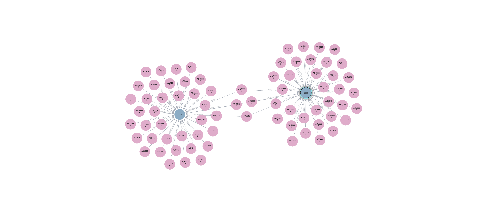

# Fraud Detection with Neo4j — Guide

<p align="center">
  
</p>

<p align="center">
  <em>End-to-end fraud detection pipeline using Neo4j graphs and Streamlit dashboards.<br>
  Model transactions as nodes and relationships to uncover shared devices, high-risk jurisdictions, and suspicious money flows.</em>
</p>

---

## Table of Contents
1. [Prerequisites](#-prerequisites)
2. [Repository Structure](#-repository-structure)
3. [Quick Start](#-quick-start)
4. [Detailed Steps](#-detailed-steps)
5. [Setting Neo4j Credentials](#-setting-neo4j-credentials)
6. [Lab Questions](#-lab-questions)
7. [What to Submit](#-what-to-submit)
8. [Troubleshooting](#-troubleshooting)
9. [Appendix](#-appendix)

---

## Prerequisites

Install the following before starting:

- [Git](https://git-scm.com/)
- [Python 3.9+](https://www.python.org/downloads/) (3.10 or 3.11 recommended)
- [Neo4j Desktop](https://neo4j.com/download/)
- [VS Code](https://code.visualstudio.com/) *(optional but recommended)*

Install required Python packages later using:

```bash
pip install -r requirements.txt

```


## Repository Structure
```bash

fraud-detection-neo4j/
│
├── data/
│   └── transactions.csv           # (generated) main CSV dataset
│
├── scripts/
│   ├── data_gen.py                # script to generate transactions.csv
│   ├── neo4j_import.cypher        # Cypher script to create nodes/relationships
│   ├── fraud_lab_queries.cypher   # (optional) lab queries for students
│   └── streamlit_app.py           # Streamlit dashboard (reads Neo4j)
│
├── images/                        # exported visuals
│   ├── graph_shared_devices.png
│   └── dashboard_preview.png
│
├── requirements.txt
└── README.md
```


## Quick Start

If you just want to get everything running quickly:

```bash
# 1️⃣ Clone this repo
git clone https://github.com/arjunghosh4/fraud-detection-neo4j.git
cd fraud-detection-neo4j

# 2️⃣ Create a virtual environment
python -m venv .venv
source .venv/bin/activate        # macOS / Linux
# OR
.venv\Scripts\activate           # Windows

# 3️⃣ Install dependencies
pip install -r requirements.txt

# 4️⃣ Generate the dataset
python scripts/data_gen.py

# 5️⃣ Import data into Neo4j
#   - Start Neo4j Desktop
#   - Copy data/transactions.csv → Neo4j import folder
#   - Run this inside Neo4j Browser:
:source scripts/neo4j_import.cypher

# 6️⃣ Run the Streamlit dashboard
streamlit run scripts/streamlit_app.py
```

Then open your browser at http://localhost:8501 


## Detailed Steps

# 1️⃣ Create a New Neo4j DBMS
	1.	Open Neo4j Desktop.
	2.	Create a new Project → Name it Fraud Lab.
	3.	Add a Local DBMS:
	•	Name: fraud-detection-db
	•	Password: neo4j2025 (or any password you choose)
	4.	Start the DBMS (click ▶️ Play).
	5.	Note the Import folder path:
	•	Right-click → Manage → Files → find “Import Folder”.

# 2️⃣ Copy CSV File into Import Folder

```bash
# Example macOS/Linux:
cp data/transactions.csv "/Users/<you>/Library/Application Support/Neo4j Desktop/Application/relate-data/dbmss/<db-id>/import/"

# Example Windows (PowerShell):
Copy-Item -Path ".\data\transactions.csv" -Destination "C:\Users\<you>\Neo4j\relate-data\dbmss\<db-id>\import"
```

# 3️⃣ Load Data into Neo4j

In Neo4j Browser, run:
```bash
LOAD CSV WITH HEADERS FROM "file:///transactions.csv" AS row
RETURN count(row);
```

You should see the total row count.
Then import:
```bash
:source scripts/neo4j_import.cypher
```

This creates:
	•	Account, Device, and Country nodes
	•	Relationships: TRANSFERRED_TO, USED_DEVICE, and LOCATED_IN


## Setting Neo4j Credentials

Before running the Streamlit app, create a .env file inside scripts/ with:
```bash
NEO4J_URI=bolt://localhost:7687
NEO4J_USER=neo4j
NEO4J_PASSWORD=neo4j2025
```

⚠️ Replace neo4j2025 with your own DBMS password.
Keep this file private — do not commit it to GitHub.

If you don’t want to use .env, you can also set environment variables manually:

macOS / Linux

```bash
export NEO4J_URI="bolt://localhost:7687"
export NEO4J_USER="neo4j"
export NEO4J_PASSWORD="your_password"
```

Windows (PowerShell)
```bash
$env:NEO4J_URI="bolt://localhost:7687"
$env:NEO4J_USER="neo4j"
$env:NEO4J_PASSWORD="your_password"
```

Once credentials are set, run:

```bash
streamlit run scripts/streamlit_app.py
```

## Lab Questions

What to deliver for each question:
	•	Query text (copy into your answers)
	•	PNG exported from Neo4j (put in /images/)
	•	Short interpretation (2–4 sentences): what pattern is visible and why it might be suspicious


## What to Submit

If submitting as coursework:
	•	/images/ folder with at least 4 exported visuals
	•	Queries used and short 2–3 line interpretations
	•	Optional: Streamlit screenshot (dashboard_preview.png)
	•	A link to your GitHub repo or zipped folder


## Troubleshooting

# LOAD CSV gives “file not found” or Failed to fetch file
Make sure transactions.csv is in your DBMS import folder (the path shown in Neo4j Desktop → Manage → Files). Use file:///transactions.csv exactly.

# Permission denied / import fails
Ensure the DBMS is running before running LOAD CSV. Restart DBMS and try again.

# Streamlit fails to connect to Neo4j
Edit scripts/ .env to set the correct Neo4j password and URI. Example:

The app loads credentials automatically from your .env file.
If Streamlit fails to connect, confirm that your .env file (in scripts/) contains:

```bash
NEO4J_URI=bolt://localhost:7687
NEO4J_USER=neo4j
NEO4J_PASSWORD=your_password
```

and that your Neo4j Desktop DBMS is running locally.

# Queries return no results
Try a simple check:

```bash
MATCH (n) RETURN count(n);
```

If zero, the import did not run — re-run neo4j_import.cypher.

# PNGs too small or crowded
Use LIMIT to reduce returned nodes. Try different layouts (Radial, Force-directed) and increase Neo4j Browser zoom before exporting.


## 📘 Appendix

# Clear the graph (if you want to re-import fresh data):
```bash
MATCH (n) DETACH DELETE n;
```

# Run a single file of Cypher commands (paste into Neo4j Browser):
	•	Open the .cypher file and paste contents → run
	•	OR :source scripts/fraud_lab_queries.cypher (browser support varies; copy-paste is safest)

# Neo4j Browser tips
	•	Use the left sidebar to access query history and favorites
	•	Use the Graph Style palette to color nodes by label and show label text
	•	Use the camera icon to export images


<p align="center">
  <em>Developed by Arjun Krishna Ghosh, visualize fraud detection through connected data and graph analytics.</em>
</p>